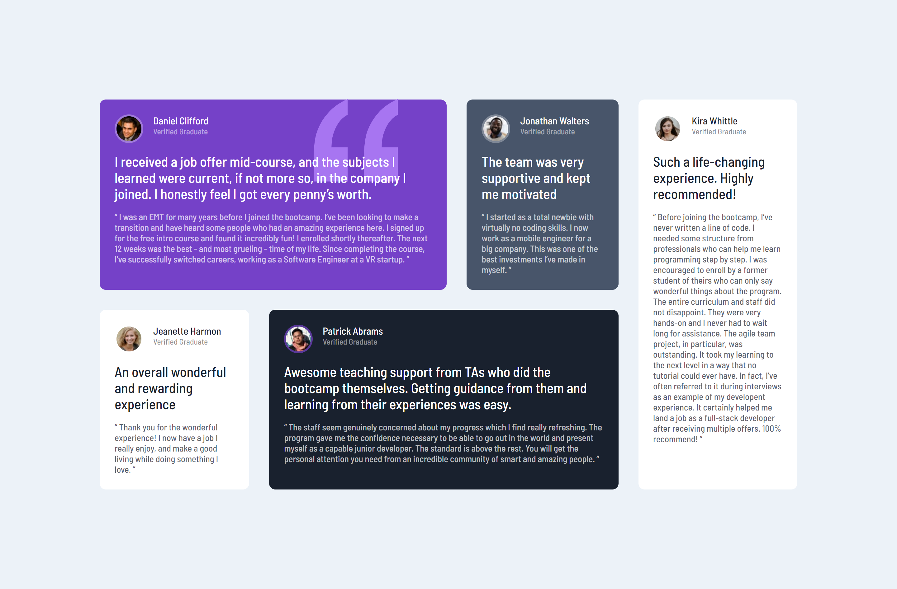

# Frontend Mentor - Testimonials grid section solution

This is a solution to the [Testimonials grid section challenge on Frontend Mentor](https://www.frontendmentor.io/challenges/testimonials-grid-section-Nnw6J7Un7).

## Table of contents

- [Overview](#overview)
  - [The challenge](#the-challenge)
  - [Screenshot](#screenshot)
  - [Links](#links)
- [My process](#my-process)
  - [Built with](#built-with)
  - [What I learned](#what-i-learned)
  - [Useful resources](#useful-resources)
- [Author](#author)

## Overview

### The challenge

Users should be able to:

- View the optimal layout for the site depending on their device's screen size

### Screenshot

Desktop screenshot



Mobile screenshot


### Links

- Solution URL: [Repository](https://github.com/kushagarwal11ag/testimonial)
- Live Site URL: [Website](https://kushagarwal11ag.github.io/testimonial/)

## My process

### Built with

- Semantic HTML5 markup
- CSS custom properties
- Flexbox
- CSS Grid
- Mobile-first workflow

### What I learned

Applied the design nearly to perfection and made the website as responsive as possible without breaking any feature or losing text.
1. Learned how to better make use of css grids.
2. Learned how to use z-index to either add elements in front or back of another element.


```css
.purple::before {
	content: url(images/bg-pattern-quotation.svg);
	position: absolute;
	right: 10%;
	top: 3%;
  z-index: 0;
  transform: scale(1.3);
}

main {
	grid-template-areas:
		"pur pur pur pur gra whi2"
		"whi bla bla bla bla whi2";
}
```

### Useful resources

- [z-index](https://stackoverflow.com/questions/15782078/bring-element-to-front-using-css) - This helped me to better understand the use of z-index and apply it.

## Author

- Frontend Mentor - [@kushagarwal11ag](https://www.frontendmentor.io/profile/kushagarwal11ag)
